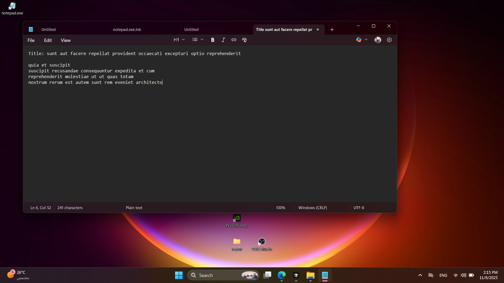
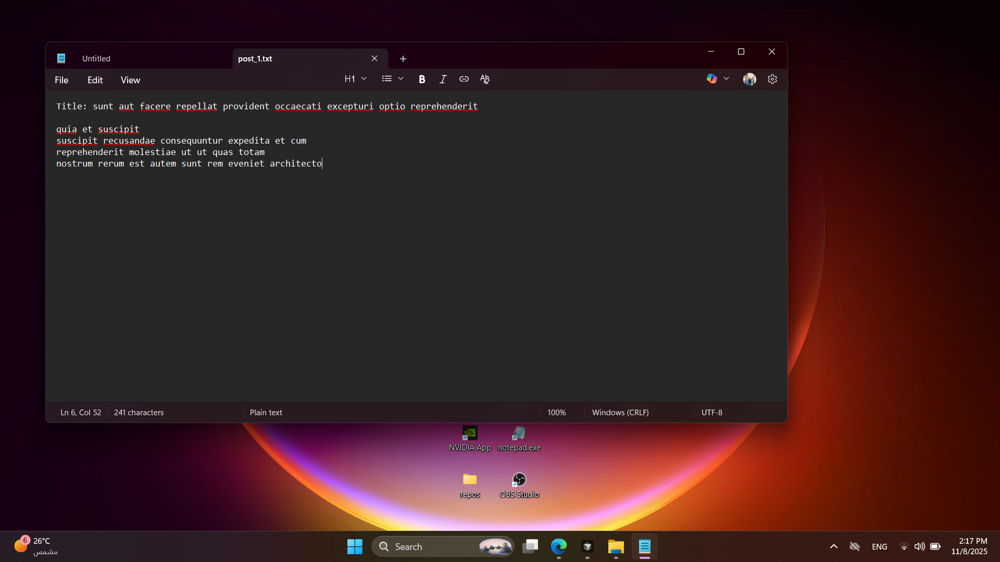
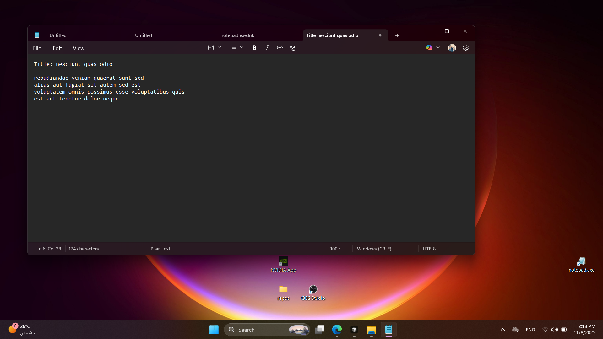

# TJM Bot

Desktop automation bot that fetches posts from an API and writes them to Notepad files using computer vision for icon detection.

## Requirements

- Python 3.13 or higher
- [UV](https://github.com/astral-sh/uv) package manager
- Windows OS (for Notepad automation)

## Installation

1. Install UV if you haven't already:

   ```bash
   pip install uv
   ```

2. Clone the repository:

   ```bash
   git clone <repository-url>
   cd tjm-bot
   ```

3. Install dependencies with UV:
   ```bash
   uv sync
   ```

## Usage

Run the bot:

```bash
uv run python main.py
```

The bot will:

1. Fetch posts from the configured API
2. Find the Notepad icon on your desktop using template matching
3. Launch Notepad and write each post's content
4. Save files to `~/Desktop/tjm-project/` as `post_{id}.txt`
5. Process the first 10 posts

## Configuration

Edit `src/config.py` to customize:

- `API_URL`: API endpoint for fetching posts
- `PROJECT_PATH`: Directory where files are saved
- `TEMPLATE_DIR`: Location of icon template images
- `MATCHING_THRESHOLD`: Template matching confidence (0.0-1.0)
- `FIND_WAIT_TIME`: Timeout for finding icons (milliseconds)

## Project Structure

```
tjm-bot/
├── assets/
│   └── templates/     # Icon template images for detection
├── src/
│   ├── config.py      # Configuration constants
│   ├── icon_detector.py  # Template registration and icon finding
│   └── notepad.py     # Notepad window management
├── main.py            # Entry point
└── pyproject.toml     # Project dependencies
```

## Dependencies

- `botcity-framework-core`: Desktop automation framework
- `pyautogui`: GUI automation
- `requests`: HTTP client for API calls
- `PyGetWindow`: Window management
- `pyperclip`: Clipboard operations

## Deliverables

The following annotated screenshots are located in the `deliverables/` folder, demonstrating icon detection in different screen areas:

### Icon detected in top-left area



### Icon detected in center of screen



### Icon detected in bottom-right area



### Video to show the bot in action


